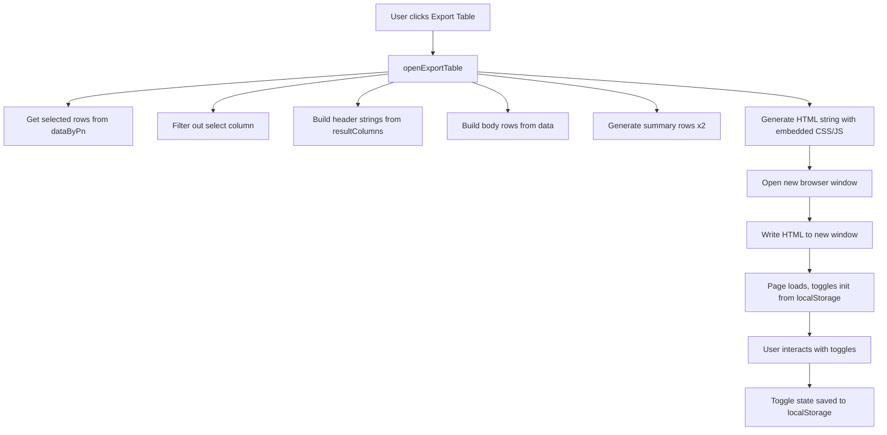

# Export Table Window — Improvement Plan

## Overview

Three changes requested for the Export Table window (opened via [`openExportTable()`](app.js:1552)):

1. Integrate Max Height into the "Size mm" column header and data
2. Rename "I (⊿T=40C) Method B A" header to "I (⊿T=40C) A"
3. Add localStorage persistence for toggle states

---

## Task 1: Integrate Max H into Size Column

### Current Behavior

The [`resultColumns`](app.js:66) array defines two separate columns:

```js
{ key: "Size (mm)", label: "Size", sub: "mm", type: "size" },       // index 9
{ key: "Max Height (mm)", label: "Max H", sub: "mm", type: "number" }, // index 10
```

In the Export Table, these become two separate columns: "Size mm" and "Max H mm".

### Desired Behavior

The "Size mm" column should display dimensions as `L x W x Max H` (e.g., `10,9 x 10 x 5`), and the separate "Max H mm" column should be removed from the export.

### Changes Required

**In [`openExportTable()`](app.js:1552):**

1. **Merge the two columns**: When building [`exportColumns`](app.js:1557), combine the "Size (mm)" and "Max Height (mm)" columns into one. The merged column should:
   - Use `key: "Size (mm)"` (keep the original size key)
   - Label: `"Size"`, sub: `"mm"` (keep existing)
   - But the data rendering should output `L x W x Max H` format

2. **Update data rendering**: For the merged Size column, format the value as:
   ```
   {L} x {W} x {Max H}
   ```
   Where L = `row["L (mm)"]`, W = `row["W (mm)"]`, Max H = `row["Max Height (mm)"]`
   
   Use comma as decimal separator (matching existing [`formatSizeValue()`](app.js:170) behavior).

3. **Update the `extraCols` indices**: Since we're removing one column, the indices `[2, 4, 6, 8]` used for extra columns (toggled by "Show Tol %..." toggle) need to be recalculated.

### Column Index Analysis

After removing the select column (index 0), the export columns are:

| Index | Column Key | Extra? |
|-------|-----------|--------|
| 0 | Part Number | No |
| 1 | Lo (uH) | No |
| 2 | Lo Tol. (%) | **Yes** |
| 3 | Method B (A typ at 40℃) | No |
| 4 | Method A (A typ at 40℃) | **Yes** |
| 5 | ⊿L=-30% typ (A) | No |
| 6 | ⊿L=-20% typ (A) | **Yes** |
| 7 | DCR Typ (mOhm) | No |
| 8 | DCR Max (mOhm) | **Yes** |
| 9 | Size (mm) | No |
| 10 | Max Height (mm) | No → **REMOVED** |
| 11 | Temp Range (deg.C) | No |
| 12 | Automotive Grade | No |
| 13 | Feature | No |
| 14 | Series | No |
| 15 | Status | No |

After removing Max Height (index 10), the extra column indices remain `[2, 4, 6, 8]` since the removed column is after all extra columns. **No index change needed.**

---

## Task 2: Rename "I (⊿T=40C) Method B A" to "I (⊿T=40C) A"

### Current Behavior

In [`resultColumns`](app.js:66), the Method B column is:

```js
{
  key: "Method B (A typ at 40℃)",
  label: "I (⊿T=40C)",
  sub: "Method B A",    // <-- this produces "I (⊿T=40C) Method B A"
  type: "number",
  className: "col-tight"
}
```

The header is built as `label + " " + sub` → `"I (⊿T=40C) Method B A"`.

### Desired Behavior

Header should read `"I (⊿T=40C) A"` — remove "Method B" from the sub text.

### Changes Required

In [`resultColumns`](app.js:66), change the `sub` for the Method B column from `"Method B A"` to just `"A"`.

**Line 74:** `sub: "Method B A"` → `sub: "A"`

This is a one-line change in the data definition. The header generation code at line 1560 (`return \`${col.label}${col.sub ? " " + col.sub : ""}\``) remains unchanged.

---

## Task 3: localStorage Persistence for Toggle States

### Current Behavior

In the Export Table HTML (generated at line 1590), the three toggles are initialized to `false` (lines 1764-1766):

```js
extraColsToggle.checked = false;
basicInfoToggle.checked = false;
remarksToggle.checked = false;
```

Every time the Export Table is opened, toggles start in the OFF position.

### Desired Behavior

The toggles should remember their last state across Export Table sessions using `localStorage`.

### Implementation Approach

This is straightforward with `localStorage`. The Export Table is opened in a new browser window/tab, so we need to:

1. **Save toggle state** when a toggle changes — write to `localStorage` with a key like `pcc_export_extraCols`, `pcc_export_basicInfo`, `pcc_export_remarks`.

2. **Restore toggle state** on page load — read from `localStorage` and set initial checked state.

3. **Use a prefix** like `pcc_export_` to avoid collisions with other data.

### Changes Required

In the `<script>` section of the generated HTML (lines 1693-1769):

**Replace the initialization section (lines 1763-1768):**

```js
// Initialize with localStorage-persisted toggle states
const savedExtraCols = localStorage.getItem('pcc_export_extraCols');
const savedBasicInfo = localStorage.getItem('pcc_export_basicInfo');
const savedRemarks = localStorage.getItem('pcc_export_remarks');

extraColsToggle.checked = savedExtraCols === 'true';
basicInfoToggle.checked = savedBasicInfo === 'true';
remarksToggle.checked = savedRemarks === 'true';

// Apply initial states
if (extraColsToggle.checked) mainDataTable.classList.remove('extra-cols-hidden');
updateSummaryTable(basicInfoToggle.checked);
updateRemarksColumnVisibility(remarksToggle.checked);

// Persist toggle changes
extraColsToggle.addEventListener('change', (e) => {
  localStorage.setItem('pcc_export_extraCols', e.target.checked);
  // ... existing handler
});

basicInfoToggle.addEventListener('change', (e) => {
  localStorage.setItem('pcc_export_basicInfo', e.target.checked);
  // ... existing handler
});

remarksToggle.addEventListener('change', (e) => {
  localStorage.setItem('pcc_export_remarks', e.target.checked);
  // ... existing handler
});
```

---

## Summary of File Changes

All changes are in [`app.js`](app.js):

| Line(s) | Change Description |
|---------|-------------------|
| 74 | `sub: "Method B A"` → `sub: "A"` (Task 2) |
| 1557-1576 | Merge "Size (mm)" and "Max Height (mm)" columns in export; render combined L×W×H data (Task 1) |
| 1661-1669 | Update extraCols indices if needed (verify after merge) (Task 1) |
| 1763-1768 | Replace static initialization with localStorage-persisted values (Task 3) |
| 1747-1761 | Add localStorage save calls to toggle event handlers (Task 3) |

## Mermaid Diagram: Export Table Data Flow


