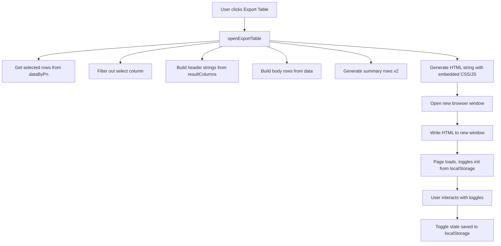

# Export Table Window — Improvement Plan

## Overview

Three changes requested for the Export Table window (opened via [`openExportTable()`](app.js:1552)):

1. Integrate Max Height into the "Size mm" column header and data
2. Rename "I (⊿T=40C) Method B A" header to "I (⊿T=40C) A"
3. Add localStorage persistence for toggle states

---

## Task 1: Integrate Max H into Size Column

### Current Behavior

The [`resultColumns`](app.js:66) array defines two separate columns:

```js
{ key: "Size (mm)", label: "Size", sub: "mm", type: "size" },       // index 9
{ key: "Max Height (mm)", label: "Max H", sub: "mm", type: "number" }, // index 10
```

In the Export Table, these become two separate columns: "Size mm" and "Max H mm".

### Desired Behavior

The "Size mm" column should display dimensions as `L x W x Max H` (e.g., `10,9 x 10 x 5`), and the separate "Max H mm" column should be removed from the export.

### Changes Required

**In [`openExportTable()`](app.js:1552):**

1. **Merge the two columns**: When building [`exportColumns`](app.js:1557), combine the "Size (mm)" and "Max Height (mm)" columns into one. The merged column should:
   - Use `key: "Size (mm)"` (keep the original size key)
   - Label: `"Size"`, sub: `"mm"` (keep existing)
   - But the data rendering should output `L x W x Max H` format

2. **Update data rendering**: For the merged Size column, format the value as:
   ```
   {L} x {W} x {Max H}
   ```
   Where L = `row["L (mm)"]`, W = `row["W (mm)"]`, Max H = `row["Max Height (mm)"]`
   
   Use comma as decimal separator (matching existing [`formatSizeValue()`](app.js:170) behavior).

3. **Update the `extraCols` indices**: Since we're removing one column, the indices `[2, 4, 6, 8]` used for extra columns (toggled by "Show Tol %..." toggle) need to be recalculated.

### Column Index Analysis

After removing the select column (index 0), the export columns are:

| Index | Column Key | Extra? |
|-------|-----------|--------|
| 0 | Part Number | No |
| 1 | Lo (uH) | No |
| 2 | Lo Tol. (%) | **Yes** |
| 3 | Method B (A typ at 40℃) | No |
| 4 | Method A (A typ at 40℃) | **Yes** |
| 5 | ⊿L=-30% typ (A) | No |
| 6 | ⊿L=-20% typ (A) | **Yes** |
| 7 | DCR Typ (mOhm) | No |
| 8 | DCR Max (mOhm) | **Yes** |
| 9 | Size (mm) | No |
| 10 | Max Height (mm) | No → **REMOVED** |
| 11 | Temp Range (deg.C) | No |
| 12 | Automotive Grade | No |
| 13 | Feature | No |
| 14 | Series | No |
| 15 | Status | No |

After removing Max Height (index 10), the extra column indices remain `[2, 4, 6, 8]` since the removed column is after all extra columns. **No index change needed.**

---

## Task 2: Rename "I (⊿T=40C) Method B A" to "I (⊿T=40C) A"

### Current Behavior

In [`resultColumns`](app.js:66), the Method B column is:

```js
{
  key: "Method B (A typ at 40℃)",
  label: "I (⊿T=40C)",
  sub: "Method B A",    // <-- this produces "I (⊿T=40C) Method B A"
  type: "number",
  className: "col-tight"
}
```

The header is built as `label + " " + sub` → `"I (⊿T=40C) Method B A"`.

### Desired Behavior

Header should read `"I (⊿T=40C) A"` — remove "Method B" from the sub text.

### Changes Required

In [`resultColumns`](app.js:66), change the `sub` for the Method B column from `"Method B A"` to just `"A"`.

**Line 74:** `sub: "Method B A"` → `sub: "A"`

This is a one-line change in the data definition. The header generation code at line 1560 (`return \`${col.label}${col.sub ? " " + col.sub : ""}\``) remains unchanged.

---

## Task 3: localStorage Persistence for Toggle States

### Current Behavior

In the Export Table HTML (generated at line 1590), the three toggles are initialized to `false` (lines 1764-1766):

```js
extraColsToggle.checked = false;
basicInfoToggle.checked = false;
remarksToggle.checked = false;
```

Every time the Export Table is opened, toggles start in the OFF position.

### Desired Behavior

The toggles should remember their last state across Export Table sessions using `localStorage`.

### Implementation Approach

This is straightforward with `localStorage`. The Export Table is opened in a new browser window/tab, so we need to:

1. **Save toggle state** when a toggle changes — write to `localStorage` with a key like `pcc_export_extraCols`, `pcc_export_basicInfo`, `pcc_export_remarks`.

2. **Restore toggle state** on page load — read from `localStorage` and set initial checked state.

3. **Use a prefix** like `pcc_export_` to avoid collisions with other data.

### Changes Required

In the `<script>` section of the generated HTML (lines 1693-1769):

**Replace the initialization section (lines 1763-1768):**

```js
// Initialize with localStorage-persisted toggle states
const savedExtraCols = localStorage.getItem('pcc_export_extraCols');
const savedBasicInfo = localStorage.getItem('pcc_export_basicInfo');
const savedRemarks = localStorage.getItem('pcc_export_remarks');

extraColsToggle.checked = savedExtraCols === 'true';
basicInfoToggle.checked = savedBasicInfo === 'true';
remarksToggle.checked = savedRemarks === 'true';

// Apply initial states
if (extraColsToggle.checked) mainDataTable.classList.remove('extra-cols-hidden');
updateSummaryTable(basicInfoToggle.checked);
updateRemarksColumnVisibility(remarksToggle.checked);

// Persist toggle changes
extraColsToggle.addEventListener('change', (e) => {
  localStorage.setItem('pcc_export_extraCols', e.target.checked);
  // ... existing handler
});

basicInfoToggle.addEventListener('change', (e) => {
  localStorage.setItem('pcc_export_basicInfo', e.target.checked);
  // ... existing handler
});

remarksToggle.addEventListener('change', (e) => {
  localStorage.setItem('pcc_export_remarks', e.target.checked);
  // ... existing handler
});
```

---

## Summary of File Changes

All changes are in [`app.js`](app.js):

| Line(s) | Change Description |
|---------|-------------------|
| 74 | `sub: "Method B A"` → `sub: "A"` (Task 2) |
| 1557-1576 | Merge "Size (mm)" and "Max Height (mm)" columns in export; render combined L×W×H data (Task 1) |
| 1661-1669 | Update extraCols indices if needed (verify after merge) (Task 1) |
| 1763-1768 | Replace static initialization with localStorage-persisted values (Task 3) |
| 1747-1761 | Add localStorage save calls to toggle event handlers (Task 3) |

## Mermaid Diagram: Export Table Data Flow



---

# Round 2 - Additional Export Table Changes

## Overview

New requests for the Export Table window (opened via openExportTable at app.js:1552):

1. Units in square brackets - wrap unit sub-labels in square brackets in the main data table headers
2. Rename Feature column to Datasheet - with the Panasonic product link hyperlinked to the cell text
3. uH to micro sign everywhere - replace the micro sign
4. R to DCR - in the summary Description text, headers stay as-is

## Task 4: Units in Square Brackets

### Current Behavior

Headers are built in openExportTable at app.js:1561 from label plus sub:

```js
const header = exportColumns.map((col) => {
  if (col.key === "Automotive Grade") return "AECQ-200";
  return `${col.label}${col.sub ? " " + col.sub : ""}`;
});
```

This produces headers like L uH, Size mm, DCR Typ mOhm, Temp Range deg.C.

### Desired Behavior

Wrap the unit sub in square brackets: L [uH], Size [mm], DCR Typ [mOhm], DCR Max [mOhm], Temp Range [deg.C], Tol [percent], Isat Delta L -30 percent [A], I (Delta T=40C) [Method A A].

Note: for the DCR columns the sub is Typ mOhm and Max mOhm. Only the unit portion mOhm goes in brackets, so the headers become DCR Typ [mOhm] and DCR Max [mOhm].

### Changes Required

In openExportTable at app.js:1561, change the header builder to wrap the unit portion of sub in brackets. For the DCR columns, split the descriptor (Typ/Max) from the unit (mOhm) so only the unit is bracketed:

```js
const header = exportColumns.map((col) => {
  if (col.key === "Automotive Grade") return "AECQ-200";
  if (col.key === "Feature") return "Datasheet";
  let sub = col.sub || "";
  // DCR columns: sub is "Typ mOhm" / "Max mOhm" - bracket only the unit
  if (col.key === "DCR Typ (mOhm)" || col.key === "DCR Max (mOhm)") {
    const parts = sub.split(" ");
    const unit = parts.pop();
    return `${col.label} ${parts.join(" ")} [${unit}]`;
  }
  return `${col.label}${sub ? " [" + sub + "]" : ""}`;
});
```

Method B special header at app.js:1675: the toggleable sub span renders Method B [A] when extra cols are shown, and [A] when hidden. The Method B descriptor is inside the span so it is hidden when cols are off:

```html
I (Delta T=40C) <span class="method-b-sub">Method B [A]</span>
```

and in updateMethodBHeader at app.js:1763 set the sub text to Method B [A] or [A].

Method A column (sub Method A A) is handled in the header builder so the descriptor stays outside the brackets, producing I (Delta T=40C) Method A [A].

Resulting Method headers:
- Cols shown: Method B = I (Delta T=40C) Method B [A], Method A = I (Delta T=40C) Method A [A]
- Cols hidden: Method B = I (Delta T=40C) [A] (no Method B descriptor), Method A hidden

## Task 5: Rename Feature Column to Datasheet with Hyperlink

### Current Behavior

The Feature column at resultColumns app.js:93 renders in the export as header Feature and cell text via displayCategoryValue at app.js:163. Each data row already contains a URL field with the Panasonic product link.

### Desired Behavior

- Header renamed to Datasheet
- Each cell text (the Feature value) becomes a hyperlink to the row Panasonic product URL, opening in a new tab

### Changes Required

Header at openExportTable app.js:1561: add a special case so the Feature column header renders as Datasheet. Do NOT change the resultColumns key, which is still used for filtering:

```js
if (col.key === "Feature") return "Datasheet";
```

Cell at openExportTable app.js:1565: add a special case in bodyRows so the Feature cell renders a hyperlink:

```js
if (col.key === "Feature") {
  const url = row.URL;
  const text = displayCategoryValue(row[col.key]);
  if (url) return `<a href="${url}" target="_blank" rel="noopener noreferrer">${text}</a>`;
  return text;
}
```

Note: the Feature value in the summary Description at formatSummaryDesc app.js:1538 stays plain text with no link. Only the export table column is hyperlinked.

## Task 6: uH to Micro Sign Everywhere

### Current Behavior

The Lo uH column sub in resultColumns at app.js:69 is uH, producing the header L uH.

### Desired Behavior

Use the micro sign instead of u: header becomes L [micro H].

### Changes Required

In resultColumns at app.js:69, change sub from uH to micro H.

This single change propagates to both the main results table header and the export table header since both derive from resultColumns. The summary Description already uses the micro sign at formatSummaryDesc app.js:1495, so no change needed there.

## Task 7: R to DCR in Summary Description

### Current Behavior

In formatSummaryDesc at app.js:1522, the DCR entry is rendered as:

```js
parts.push(`R: ${dcr}mOhm`);
```

### Desired Behavior

Change the label from R to DCR:

```js
parts.push(`DCR: ${dcr}mOhm`);
```

The Part Number Summary section header and the Description column header remain unchanged.

## Summary of File Changes Round 2

All changes are in app.js:

| Line | Change Description |
|------|-------------------|
| 69 | sub uH to micro H (Task 6) |
| 1522 | R to DCR (Task 7) |
| 1561-1564 | Wrap sub in brackets; add Feature to Datasheet header case (Tasks 4, 5) |
| 1565-1586 | Add Feature cell hyperlink case using row.URL (Task 5) |
| 1675-1677 | Wrap Method B sub in brackets (Task 4) |
| 1763-1769 | Update updateMethodBHeader sub text to [Method B A] or [A] (Task 4) |

---

# Round 3 - Remarks Column in Main Export Table

## Overview

Add an editable Remarks column to the MAIN data table in the export window. Reuse the existing Show Remarks Column toggle to control BOTH the main table and summary table Remarks columns. Relocate the toggle to sit directly under the Show Tol percent toggle (above the main table). Remarks are editable within the current session only (no localStorage persistence of text).

## Task 8: Remarks Column in Main Table

### Current Behavior

The main data table (id mainDataTable) has no Remarks column. The Show Remarks Column toggle (remarksToggle) currently only controls the summary table Remarks column via updateRemarksColumnVisibility at app.js:1772.

### Desired Behavior

- The main data table gets a Remarks column with editable cells (contenteditable), one per row.
- The existing Show Remarks Column toggle controls BOTH the main table and summary table Remarks columns.
- The toggle is relocated to sit directly under the Show Tol percent toggle, above the main table.
- Remarks text is editable within the current session only.

### Changes Required

**1. Relocate the Show Remarks Column toggle** (currently at app.js:1715-1721): move the toggle-container block to directly after the Show Tol percent toggle block (after app.js:1684-1690), so it appears above the main table.

**2. Add Remarks header cell** to the main table header (app.js:1691-1699): append a Remarks th after the existing header cells:

```html
<th class="remarks-column">Remarks</th>
```

**3. Add editable Remarks cell** to each main table body row (app.js:1700-1705): append a contenteditable td after the existing cells. The part number is the first cell of each row (r[0]):

```js
.map((r) => `<tr>${r.map((c, i) => {
  const extraCols = new Set([2, 4, 6, 8]);
  return `<td${extraCols.has(i) ? ' class="extra-col"' : ''}>${c}</td>`;
}).join("")}<td class="remarks-column" contenteditable="true" data-pn="${r[0]}"></td></tr>`)
```

**4. Update updateRemarksColumnVisibility** (app.js:1772) to control both tables:

```js
function updateRemarksColumnVisibility(showRemarks) {
  mainDataTable.classList.toggle('hide-remarks', !showRemarks);
  summaryTable.classList.toggle('hide-remarks', !showRemarks);
}
```

**5. Add CSS** for hiding the main table Remarks column (near the existing summary-table rule at app.js:1651-1655):

```css
#mainDataTable.hide-remarks .remarks-column,
#mainDataTable.hide-remarks th.remarks-column,
#mainDataTable.hide-remarks td.remarks-column {
  display: none;
}
```

The existing editable-remarks styling at app.js:1623-1643 is generic (td.remarks-column[contenteditable=true]) and already applies to the main table cells.

### Notes

- The main table body is generated once in the HTML string, so editable remarks text persists within the session as long as the cells are not re-rendered. Toggling only changes the CSS class, preserving content.
- updateSummaryTable (app.js:1731) only re-renders the summary table body, so it does not affect main table remarks.
- mainDataTable is defined at app.js:1781, before updateRemarksColumnVisibility is first called at init (app.js:1823), so no hoisting issue.

## Summary of File Changes Round 3

All changes are in app.js:

| Line | Change Description |
|------|-------------------|
| 1651-1655 | Add main table hide-remarks CSS rule (Task 8) |
| 1684-1690 | Insert relocated Show Remarks toggle after Show Tol percent toggle (Task 8) |
| 1691-1699 | Append Remarks th to main table header (Task 8) |
| 1700-1705 | Append editable Remarks td to each main table row (Task 8) |
| 1715-1721 | Remove the old Show Remarks toggle from the summary section (Task 8) |
| 1772-1778 | Update updateRemarksColumnVisibility to control both tables (Task 8) |

# Round 4 - Add Competitor Rows to Main Export Table

## Overview

Add an "Add Competitor" button next to the "Copy PNs" button in the export window. Clicking it adds a blank row to the MAIN data table where the user can type a competitor part number and fill in competitor specs. Multiple competitor rows can be added. Rows are reorderable via drag-and-drop. Competitor PNs are included in the "Copy PNs" output in the current table order.

## Task 9: Add Competitor Rows

### Current Behavior

The main data table (id mainDataTable) is generated once as a static HTML string in openExportTable() at app.js:1703-1717. The tbody rows are fixed Panasonic rows. The Copy PNs button (app.js:1740-1746) copies a static pnsList array (app.js:1734) of Panasonic part numbers joined by newline.

### Desired Behavior

- An "Add Competitor" button sits next to the "Copy PNs" button.
- Clicking it appends a blank row to the main table tbody.
- The blank row's PN cell shows the placeholder "Enter competitor PN" (clears when the user types).
- All cells in a competitor row are editable (contenteditable) so the user can fill in competitor specs.
- Each competitor row has a remove button to delete it.
- Drag-and-drop reordering is active for ALL rows in the main table — both the existing Panasonic rows AND competitor rows. This means the user can reorder the Panasonic part numbers even before adding any competitor.
- The "Copy PNs" button copies all PNs (Panasonic + competitor) in the current table order.

### Implementation Approach

Because the tbody is currently static HTML, the feature requires converting the main table body to be managed dynamically by JavaScript. The approach:

1. **Add the "Add Competitor" button** next to "Copy PNs" (app.js:1688). Wrap both buttons in a flex container so they sit side by side.

2. **NO separate drag-handle column.** To keep the table clean for manual copy/paste into Outlook, the ENTIRE row is made draggable (draggable="true" on each <tr>), with no extra drag-handle column added. This ensures that when the user manually selects and copies the table into Outlook, no extra grip column appears. A subtle cursor change (grab) on the row signals it is draggable. (Note: contenteditable cells inside a draggable row still work — drag is initiated from non-editable areas of the row, and the dragstart handler checks the event target to avoid starting a drag when the user is editing a cell.)

3. **Convert the main table tbody to dynamic rendering.** Instead of relying on the static HTML string, render the tbody via a JS function `renderMainTable()` that:
   - Takes an array of row objects (Panasonic rows + competitor rows).
   - For Panasonic rows, uses the precomputed `bodyRows` HTML cells.
   - For competitor rows, renders all cells as contenteditable with the PN cell showing the "Enter competitor PN" placeholder when empty.
   - Appends a remove button cell for competitor rows (and optionally a disabled/empty cell for Panasonic rows so columns align).
   - Appends the Remarks contenteditable cell.

4. **Maintain a JS data model** `mainRows` array holding references to Panasonic rows and competitor row objects. This drives rendering and the copy logic.

5. **Drag-and-drop reordering.** Attach HTML5 drag events (dragstart, dragover, drop, dragend) to the tbody rows. On drop, reorder the `mainRows` array and re-render the tbody. Use a `draggable` attribute on the row and visual feedback (e.g., a `.dragging` class). The dragstart handler must ignore drags that begin inside contenteditable cells (so editing text does not trigger a row drag).

6. **Dynamic Copy PNs.** Replace the static `pnsList` with a function `getPnsList()` that reads the current table order from the DOM (or the `mainRows` model) and returns the array of PNs (Panasonic + competitor, in table order), filtering out empty/placeholder values. The Copy PNs click handler calls this function.

### Outlook Copy Compatibility

Manual copy/paste of the table into Outlook remains fully functional:
- The table stays a standard HTML <table> element; selecting and copying it copies the HTML, which Outlook preserves as a formatted table.
- Drag-and-drop only adds draggable attributes and event handlers — it does not alter the cell content or table structure.
- Because NO extra drag-handle column is added, the copied table has no stray grip column in Outlook.
- The Copy PNs button still uses navigator.clipboard.writeText, unchanged, so pasting PNs into Outlook works as before.

### Changes Required

**1. Add "Add Competitor" button** (app.js:1688). Wrap Copy PNs and Add Competitor in a flex container:

```html
<div style="margin-bottom:12px; display:flex; gap:8px; align-items:center;">
  <button id="copyPnsBtn">Copy PNs</button>
  <button id="addCompetitorBtn">Add Competitor</button>
</div>
```

**2. Make each row draggable.** Set `draggable="true"` on each `<tr>` in the tbody. NO separate drag-handle column is added, so the table structure stays clean for manual copy/paste into Outlook. The dragstart handler checks the event target: if the drag begins inside a contenteditable cell (or a remove button), it is cancelled so editing text does not trigger a row drag.

**3. Convert tbody to dynamic rendering.** Replace the static tbody HTML with an empty `<tbody id="mainTableBody"></tbody>` and add a `renderMainTable()` JS function that builds rows from the `mainRows` model.

**4. Add competitor row rendering.** In `renderMainTable()`, competitor rows render all cells as contenteditable (with the PN cell showing "Enter competitor PN" placeholder when empty) plus a remove button cell.

**5. Add CSS** for:
- `.dragging` (opacity/outline feedback during drag)
- Competitor row styling (e.g., light background tint to distinguish from Panasonic rows)
- Remove button styling
- A subtle `cursor: grab` on the tbody rows to signal draggability

**6. Update Copy PNs logic** (app.js:1740-1746). Replace the static `pnsList` with a `getPnsList()` function that reads PNs from the current table order.

### Notes

- The Remarks column (Task 8) must remain functional. The dynamic renderer must still append the Remarks contenteditable cell to each row, and the hide-remarks CSS still applies.
- The extra-cols toggle (extraColsToggle) toggles CSS classes on the table; the dynamic renderer must apply the same `extra-col` classes to competitor cells so the toggle hides them consistently.
- The Method B header update (updateMethodBHeader) operates on the header, which is unaffected by tbody re-rendering.
- Drag-and-drop uses native HTML5 drag events; no external library needed.
- Competitor rows are session-only (no persistence), consistent with the Remarks behavior.
- Manual copy/paste of the table into Outlook is unaffected: no extra drag-handle column is added, and drag-and-drop only adds draggable attributes/event handlers without altering cell content or table structure.

## Summary of File Changes Round 4

All changes are in app.js:

| Line | Change Description |
|------|-------------------|
| 1688 | Wrap Copy PNs and add Add Competitor button in a flex container (Task 9) |
| 1703-1717 | Convert main table tbody to a dynamic render target (empty tbody id mainTableBody); no drag-handle column added (Task 9) |
| 1734 | Replace static pnsList with getPnsList() function (Task 9) |
| 1740-1746 | Update Copy PNs handler to use getPnsList() (Task 9) |
| new | Add renderMainTable() function and mainRows model (Task 9) |
| new | Add addCompetitorBtn click handler (Task 9) |
| new | Add drag-and-drop event handlers on tbody rows (Task 9) |
| 1676-1685 | Add CSS for dragging, competitor rows, remove button, grab cursor (Task 9) |

# Round 5 - Competitor Row Refinements

## Overview

Refinements to the Add Competitor feature based on user feedback:
1. First competitor row is inserted at the TOP of the table; subsequent competitor rows are appended at the BOTTOM.
2. Add a "Clear Competitors" button next to "Add Competitor" to remove all competitor rows.
3. Fix the drag-and-drop vs. text-selection conflict: making the whole row draggable blocks selecting/copying table text. Only a designated grip area should be draggable, so text is selectable.
4. Move the remove button out of the Remarks column and position it as a floating overlay on the row (outside the table), so it never appears in a manual copy to Outlook.

## Task 10: Competitor Row Refinements

### Current Behavior

- The add handler (app.js:1826-1832) always appends the new competitor row to the END of mainRows.
- There is no way to remove all competitor rows at once.
- Every row has draggable=true (app.js:1792, 1799), which blocks text selection in the row.
- The remove button is rendered inside the Remarks column cell (app.js:1798), so it appears in a manual table copy.

### Desired Behavior

- The first competitor row is inserted at the TOP (index 0); subsequent competitor rows are appended at the BOTTOM.
- A "Clear Competitors" button removes all competitor rows.
- Text in the table is fully selectable/copyable; drag-and-drop is only initiated from a designated grip area.
- The remove button is a floating overlay on the row (outside the table element), so it is not part of a manual copy.

### Implementation Approach

**1. First competitor row at top, subsequent at bottom.** In the add handler, check whether any competitor rows exist:
- If `competitorRows.length === 0`, insert the new row at the top: `mainRows.unshift(comp)`.
- Otherwise, append at the end: `mainRows.push(comp)`.

**2. Clear Competitors button.** Add a "Clear Competitors" button next to "Add Competitor" in the button flex container. On click, clear `competitorRows` and remove all competitor entries from `mainRows`, then re-render.

**3. Fix text selection via a grip-only drag.** The core problem is `draggable="true"` on the whole `<tr>` blocks text selection. Fix:
- Remove `draggable="true"` from the `<tr>` elements.
- Wrap the main table in a positioned container: `<div id="mainTableWrap" style="position:relative;">...</div>`.
- Render a grip overlay element (`.row-grip`, draggable="true") for each row, positioned over the row's left edge via JS. The grip is OUTSIDE the table element, so it is not copied.
- Only the grip is draggable; the table rows are not, so all text is selectable.
- Drag handlers attach to the grip overlays (or use delegation on the wrapper checking `.row-grip`). On dragstart, identify the target row; on dragover/drop, reorder the table rows and sync the model.

**4. Remove button as floating overlay.** Remove the remove button from the Remarks column cell. Instead, render a remove overlay (`.remove-competitor-btn`) for each competitor row, positioned over the row's right edge via JS, outside the table element. The Remarks column for competitor rows becomes a normal contenteditable remarks cell (matching panasonic rows), keeping column alignment.

**5. Position the overlays via JS.** Add a `positionRowControls()` function that, after each render/reorder, iterates the table rows and positions the grip and remove overlays using each row's offsetTop/offsetHeight relative to the positioned wrapper. Re-run on render, reorder, and window resize.

### Changes Required

**1. Button flex container** (app.js:1726-1729): add a "Clear Competitors" button:
```html
<div style="margin-bottom:12px; display:flex; gap:8px; align-items:center;">
  <button id="copyPnsBtn">Copy PNs</button>
  <button id="addCompetitorBtn">Add Competitor</button>
  <button id="clearCompetitorsBtn">Clear Competitors</button>
</div>
```

**2. Wrap the main table** (app.js:1744): wrap `<table id="mainDataTable">...</table>` in `<div id="mainTableWrap" style="position:relative;">...</div>`.

**3. renderMainTable()** (app.js:1784-1802):
- Remove `draggable="true"` from `<tr>` elements.
- Remove the remove button from the Remarks cell; render a normal contenteditable remarks cell for competitor rows too.
- After building the tbody, call `positionRowControls()`.

**4. Add grip and remove overlays.** In `positionRowControls()`, for each row create/update a `.row-grip` overlay (draggable) and, for competitor rows, a `.remove-competitor-btn` overlay, positioned over the row.

**5. Drag handlers** (app.js:1844-1893): change to attach to the grip overlays (delegation on `#mainTableWrap` checking `.row-grip`). On dragstart, resolve the target row; on dragover/drop, reorder and re-run `positionRowControls()`.

**6. Add handler** (app.js:1826-1832): insert first competitor at top, subsequent at bottom.

**7. Clear Competitors handler:** add `clearCompetitorsBtn` click handler.

**8. CSS:** add styles for `.row-grip` (grab cursor, overlay positioning) and adjust `.remove-competitor-btn` to be an overlay (absolute positioning, not a table cell).

### Notes

- The grip and remove overlays are OUTSIDE the `<table>` element, so they are not included in a manual copy/paste to Outlook. The table itself stays clean.
- Because the rows are no longer draggable, text selection and copy work normally.
- The Remarks column for competitor rows now holds a normal contenteditable remarks cell, so column alignment is preserved and the Remarks toggle works for competitor rows too.
- `positionRowControls()` must re-run after any render, reorder, or window resize to keep overlays aligned.

## Summary of File Changes Round 5

All changes are in app.js:

| Line | Change Description |
|------|-------------------|
| 1726-1729 | Add Clear Competitors button to the button flex container (Task 10) |
| 1744 | Wrap main table in positioned div id mainTableWrap (Task 10) |
| 1784-1802 | renderMainTable: remove draggable from rows, remove button from Remarks cell, call positionRowControls (Task 10) |
| 1826-1832 | Add handler: first competitor at top, subsequent at bottom (Task 10) |
| new | Add clearCompetitorsBtn click handler (Task 10) |
| new | Add positionRowControls() to position grip/remove overlays (Task 10) |
| 1844-1893 | Rework drag handlers to use grip overlays (Task 10) |
| CSS | Add .row-grip overlay styles; make remove button an overlay (Task 10) |

## Round 6: Apple-Style Left-Glow Grip (Task 11)

### Overview

User feedback after Round 5:
1. The drag grip icon overlapped the Part No. cell text.
2. The dot-grid icon didn't look nice; user wanted a more modern, Apple-like design with a soft glow on the left side.

### Changes Required

**1. Fix grip overlap (add left gutter).** The grip was positioned at `left: 2px` inside `#mainTableWrap`, which aligns with the table's left edge, so it sat on top of the Part No. cell. Fix by adding `padding-left: 30px` to `#mainTableWrap`, shifting the table right and creating a gutter. The grip now sits in the gutter (left of the table), never overlapping the Part No. text.

**2. Apple-style left-glow grip.** Replace the 6-dot grid with a thin vertical glowing accent bar on each row's left edge:
- Default: ~3px wide vertical bar with a subtle top/bottom-fading gradient (`rgba(0,88,163,0.35)` center), barely visible.
- Hover: bar fills with brand blue `#0058a3` and emits a soft glow (`box-shadow: 0 0 8px rgba(0,88,163,0.5)`), cursor `grab`.
- Dragging: glow intensifies (`box-shadow: 0 0 14px rgba(0,88,163,0.7)`), bar widens to 4px, cursor `grabbing`.
- The bar spans ~26px vertically, centered on each row.

**3. Keep summary table aligned.** Since the main table is shifted right by the wrapper's 30px gutter, add `margin-left: 30px` to `.summary-table` so it stays aligned with the main table.

### Files Changed (app.js)

| Line | Change Description |
|------|-------------------|
| 1712-1715 | `#mainTableWrap`: add `padding-left: 30px` for the grip gutter (Task 11) |
| 1716-1738 | `.row-grip`: redesign as vertical glow accent bar (default/hover/dragging states) (Task 11) |
| 1718-1721 | `.summary-table`: add `margin-left: 30px` to stay aligned (Task 11) |
| 1919-1926 | `positionRowControls()`: render grip as empty vertical bar (no dot grid), add title (Task 11) |
